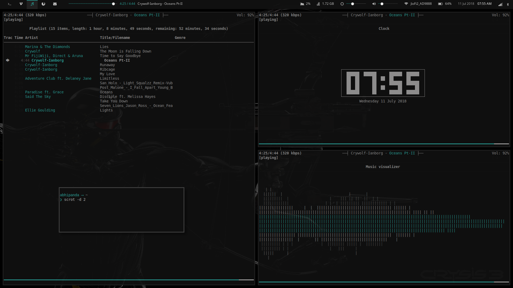
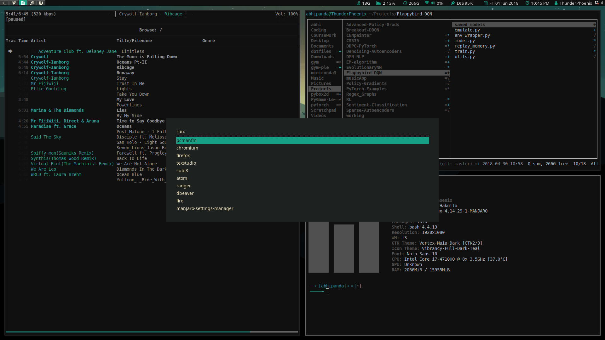
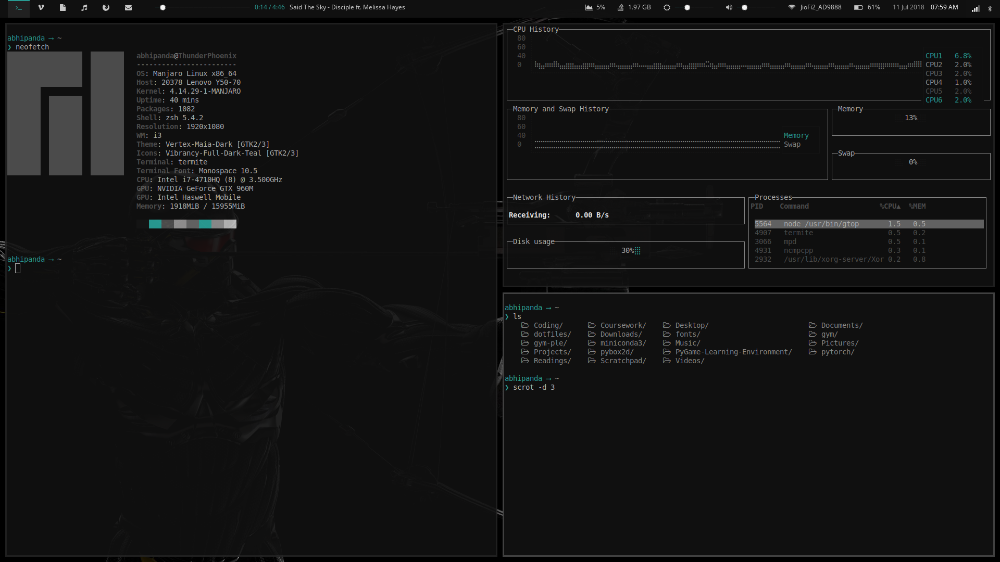
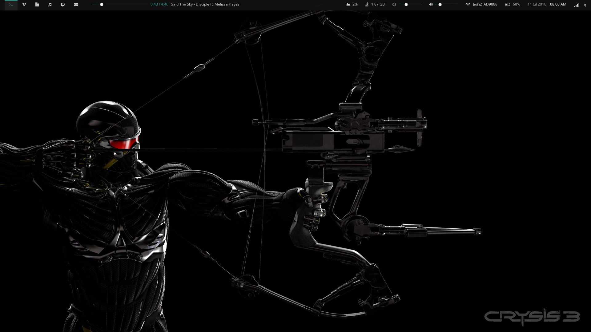

# Dotfiles for my system
* A custom tweaked vimrc file suited to my personal tastes.
* A zshrc for an informative and pleasant prompt at command line
* polybar config since I use polybar as my statusbar for i3
* Termite, ncmpcpp, dunst, mpd, jupyter, etc config files

## Steps for setting up:
Automated script coming soon

## Screenshots

